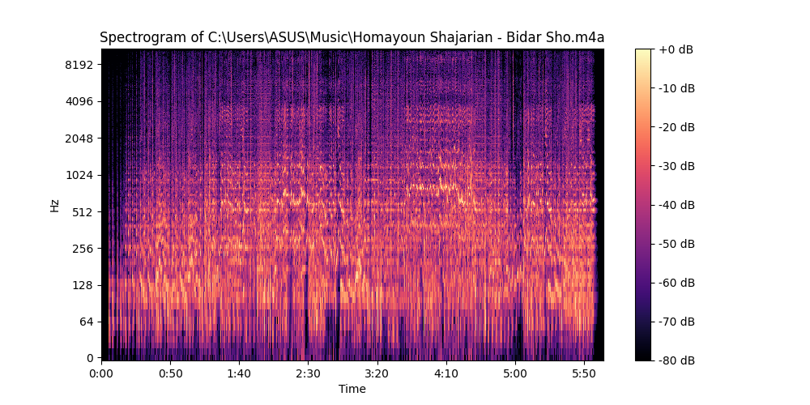

# Rhythm Music Visualizer

An application to generate a synced animation to a music based on its rythm and intensity. For now it does generate the spectrogram of the audio file.

## Installation

```bash
python -m venv .venv
.venv\Scripts\activate

pip install -r requirements.txt
```

## Usage

```bash
python main.py /path/to/audio/file --sample_rate 44100
```

## Example

```bash
# default sample rate is None, which means the sample rate of the audio file
python main.py ./samples/bidar_sho.m4a

# sample rate is 22050
python main.py ./samples/bidar_sho.m4a --sample_rate 22050

# plot horizontal lines
python main.py ./samples/bidar_sho.m4a --freq_lines 319 587 697 1048

# no horizontal lines
python main.py ./samples/bidar_sho.m4a --freq_lines
```


